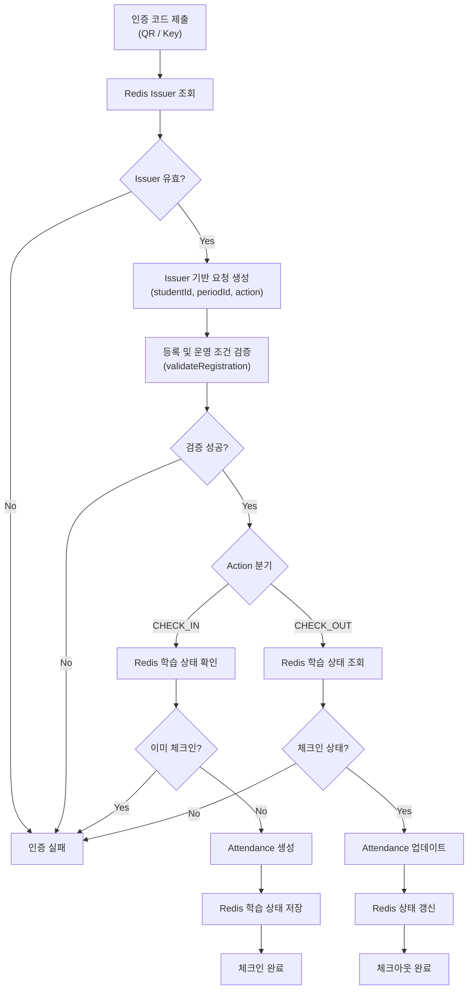
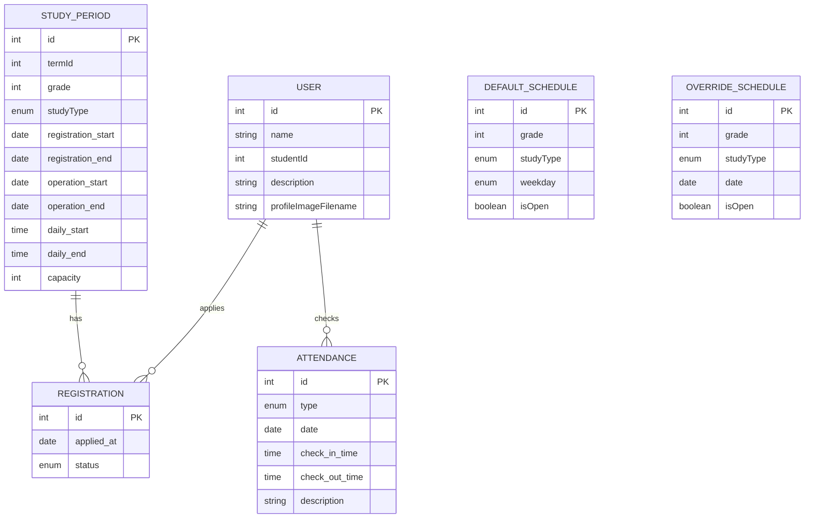

  </a>

 

# 대인고 자율학습 출석체크 키오스크 
**대인고등학교**의 자율학습 출석체크는 현재 선생님들이 수기로 작성하고 있으며,  
이 과정에서 출석 기록의 신뢰성을 보장하기 어렵다는 한계가 존재합니다. 

또한 반복적인 수기 기록은 관리 부담을 증가시키고, 출석 데이터의 체계적인 관리와 활용을 어렵게 만듭니다.

이 프로젝트는 이러한 문제를 해결하기 위해자율학습 시간의 출석체크를 자동화하고, 보다 정확하고 신뢰할 수 있는 출석 관리 환경을 제공하는 것을 목표로 합니다.

## 시스템 구조 및 주요 기능
> 출결 데이터의 **신뢰성(Reliability)** 과 **일관성(Consistency)** 을 최우선으로 설계된 통합 시스템입니다.

### 시스템 구성 개요

- 학생의 체크인은 **쉽고 빠르고 간편하며 신뢰성있는** 구조로 동작합니다.
- 키오스크 애플리케이션, 학생용 PWA, 교사용 데스크탑 앱은 **직접 데이터베이스에 접근하지 않습니다.**
- 모든 출결 관련 요청은 **단일 API 서버**를 통해 처리되어 비즈니스 로직과 데이터 처리를 중앙에서 통제합니다.

### 체크인 파이프라인
본 시스템의 체크인 기능은 **Issuer 기반 인증 구조**를 중심으로 설계되었다.  
QR 인증, 키 입력 등 다양한 인증 방식은 모두 공통된 Issuer 인증 단계를 거쳐,
단일한 체크인/체크아웃 파이프라인으로 연결된다.

#### Issuer 기반 인증

- 서버는 6자리 인증 코드를 key로 하는 Issuer 객체를 Redis에 저장한다.
- Issuer는 짧은 TTL(Time To Live)을 가지며, 일회성 또는 단기 인증을 목적으로 사용된다.
- 학생 또는 키오스크는 해당 인증 코드를 제출하여 인증을 시도한다.
- 서버는 Redis에서 코드를 조회하여 Issuer의 유효성을 검증한다.
- 인증에 성공하면 Issuer에 포함된 정보(studentId, periodId, action 등)를 기반으로
  체크인 또는 체크아웃 로직을 수행한다.

이를 통해 인증 수단(QR, 키 입력 등)은 서로 독립적으로 확장할 수 있으며,
출석 처리 로직은 하나의 공통 파이프라인으로 유지된다.

#### 체크인 처리 흐름

1. Issuer 인증 성공 후, 학생 ID와 스터디 기간 ID를 기반으로 등록 정보를 검증한다.
2. 등록 상태가 ACTIVE인지 확인하고, 운영 기간 및 일일 운영 시간 내인지 검증한다.
3. Redis를 통해 해당 학생이 이미 체크인 상태인지 확인한다.
4. 체크인 상태가 아니라면 Attendance 레코드를 생성한다.
5. Redis에 학습 상태(study)를 저장하여 체크인 세션을 관리한다.
6. 자동 체크아웃이 설정된 경우, 종료 시점에 맞춰 비동기 작업을 예약한다.

Redis는 실시간 학습 상태를 관리하는 세션 저장소로 사용되며,
데이터베이스는 출석 기록의 영속성을 보장하는 역할을 담당한다.

#### 체크아웃 처리 흐름
1. Redis에서 학생의 학습 상태를 조회한다.
2. 체크인 상태가 존재하지 않으면 체크아웃을 거부한다.
3. 현재 시간이 허용된 체크아웃 시간 범위 내인지 확인한다.
4. Attendance 레코드를 업데이트하여 체크아웃 시간을 기록한다.
5. Redis 상태를 갱신하여 학습 종료 상태를 반영한다.

---

#### 전체 체크인 흐름 다이어그램

### 맞춤형 학사일정 관리 및 운영 제어

### 데이터 분석 및 통계 제공

### 데이터베이스 설계 (ERD)
>출석 시스템은 `사용자(User)`, `신청(Registration)`, `출석 기록(Attendance)`을 중심으로 구성되어 있으며,
자율학습 `운영 기간(StudyPeriod)`을 기준으로 `신청(Registration)`을 관리합니다. `출석(Attendance)`은 사용자 단위로 기록되며, 운영 일정은 `기본 일정(DefaultSchedule)`과 특정 날짜에 대한 `예외 일정(OverrideSchedule)`으로 분리하여 설계하였습니다. 이를 통해 학사 일정 변경에 유연하게 대응할 수 있도록 하였습니다.

## 기술 스택
> 다중 클라이언트 환경을 기반으로 한 통합 시스템 구성

### 프론트 엔드

**학생용 PWA 어플리케이션**  
[![React][React.js]][React-url]
[![Vite][Vite.js]][Vite-url]

**선생님용 관리 데스크탑 어플리케이션**  
[![React][React.js]][React-url]
[![Electron][Electron.js]][Electron-url]
[![Vite][Vite.js]][Vite-url]

**키오스크 애플리케이션**  
[![React][React.js]][React-url]
[![Electron][Electron.js]][Electron-url]
[![Vite][Vite.js]][Vite-url]

---

### 백엔드

**API 서버**  
[![NestJS][NestJS]][NestJS-url]
[![NodeJS][Node.js]][Node-url]

---

### 데이터베이스 & 스토리지

[![PostgreSQL][Postgres]][Postgres-url] 
[![Redis][Redis]][Redis-url] 
[![MinIO][MinIO]][MinIO-url]

---

### 인프라 / 배포

[![Docker][Docker]][Docker-url]
[![DockerCompose][DockerCompose]][DockerCompose-url]
[![Nginx][Nginx]][Nginx-url]
[![Ubuntu][Ubuntu]][Ubuntu-url]

<!-- ## 실행 방법 -->

<!-- ## 참고사항 -->

<!-- Frontend -->
[React.js]: https://img.shields.io/badge/React-20232A?style=for-the-badge&logo=react&logoColor=61DAFB
[React-url]: https://react.dev/

[Vite.js]: https://img.shields.io/badge/Vite-646CFF?style=for-the-badge&logo=vite&logoColor=FFD62E
[Vite-url]: https://vitejs.dev/

[Electron.js]: https://img.shields.io/badge/Electron-2B2E3A?style=for-the-badge&logo=electron&logoColor=9FEAF9
[Electron-url]: https://www.electronjs.org/

<!-- Backend -->
[NestJS]: https://img.shields.io/badge/NestJS-E0234E?style=for-the-badge&logo=nestjs&logoColor=white
[NestJS-url]: https://nestjs.com/

[Node.js]: https://img.shields.io/badge/Node.js-339933?style=for-the-badge&logo=node.js&logoColor=white
[Node-url]: https://nodejs.org/

<!-- Database & Storage -->
[Postgres]: https://img.shields.io/badge/PostgreSQL-316192?style=for-the-badge&logo=postgresql&logoColor=white
[Postgres-url]: https://www.postgresql.org/

[Redis]: https://img.shields.io/badge/Redis-DC382D?style=for-the-badge&logo=redis&logoColor=white
[Redis-url]: https://redis.io/

[MinIO]: https://img.shields.io/badge/MinIO-C72E49?style=for-the-badge&logo=minio&logoColor=white
[MinIO-url]: https://min.io/

<!-- Infrastructure -->
[Docker]: https://img.shields.io/badge/Docker-2496ED?style=for-the-badge&logo=docker&logoColor=white
[Docker-url]: https://www.docker.com/

[DockerCompose]: https://img.shields.io/badge/Docker_Compose-2496ED?style=for-the-badge&logo=docker&logoColor=white
[DockerCompose-url]: https://docs.docker.com/compose/

[Ubuntu]: https://img.shields.io/badge/Ubuntu_22.04-E95420?style=for-the-badge&logo=ubuntu&logoColor=white
[Ubuntu-url]: https://ubuntu.com/

[Nginx]: https://img.shields.io/badge/Nginx-009639?style=for-the-badge&logo=nginx&logoColor=white
[Nginx-url]: https://nginx.org/